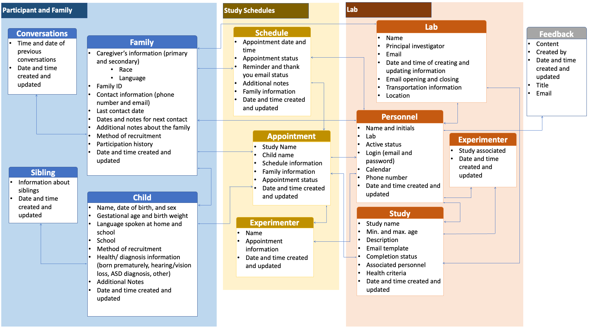

# Developmental Research Database (DRDB) System

{: .no_toc }

## Table of contents
{: .no_toc .text-delta }

* TOC
{:toc}

---

## What is the DRDB system?

The Developmental Research Database (DRDB) system is a web-based application focusing on managing developmental research. Developmental research relies on the successful management of relations between research projects, research personnel, and families from our communities. For example, researchers need to constantly maintain their participant pool by registering new families, updating existing family info, and tracking their participation history. We also need to manage our research projects and research staff assignments to ensure our projects can be implemented flawlessly.

The success of developmental research involves enormous efforts in managing complex relations among families, labs, research personnel, and projects. Extensive interactions among the stakeholders (e.g., participant recruitment and communicating experimenters) often impose significant challenges to the efficiency of research progress. Despite advancements in technology, a great proportion of developmental labs still rely on manual approaches to manage their research activities, which are both inefficient and prone to human errors. Furthermore, popular research management software is unable to streamline the entire process of developmental research, from scheduling to managing study activities.

To assist the complicated management work in developmental research, we developed the DRDB system. It stores information about research participants, research projects, research personnel, and study schedules with an industry-recognized database standard (MySQL). In addition to storing critical research data, the system is equipped with advanced algorithms, which can automate study schedule management and facilitate communication between families and researchers. The web-based design enables the system can be accessed by multiple researchers from different labs wherever they are whenever they want. This is especially useful during times when we must work remotely.

## What's in the DRDB system?

DRDB includes 3 major categories of data:
- family & children's demographic information
- lab relation information, including studies, lab members, and lab info
- study appointment information, such as appointment time and related experimenters

<figure>
      
    <figcaption>A schematic display of data structure and relatons in DRDB.</figcaption>
</figure>

<!-- ## How does the DRDB system help recruitment and research management? -->

## Access to DRDB

DRDB can be accessed here (must be connected to McMaster VPN if not on McMaster Wifi): [Developmental Research Database](https://drdb.mcmaster.ca/#/)

{: .highlight}
> Move the following contents into subpages.

Watch the second half of this video for a tutorial on DRDB: [DRDB Tutorial](https://mcmasteru365.sharepoint.com/sites/labtest/Shared%20Documents/Forms/AllItems.aspx?id=%2Fsites%2Flabtest%2FShared%20Documents%2FTraining%2FRecordings%2FRecruitment%20%26%20DRDB%20Training%2D20220525%5F180343%2DMeeting%20Recording%2Emp4&parent=%2Fsites%2Flabtest%2FShared%20Documents%2FTraining%2FRecordings)

### Family Information

#### **Add a new family to the system**

1. Navigate to the _Family Information_ page
2. Click the blue + button
3. Complete the guardian’s contact and demographic information
4. Use the white + to add their children individually

#### **How to add a child to a family**

1. Navigate to the _Family Information_ page
2. Search for the desired family
3. Click the + in the white box
4. Fill in the child’s information

#### **How to view/search a family’s information**

1. Navigate to the _Family Information_ page
2. Select search
3. Type in full or partial information into any of the contact information
4. Navigate through families that meet the criteria using the arrows at the top
5. View the child’s sensitive information by selecting edit under the child’s name

#### **How to edit the child’s information**

1. Navigate to the _Family Information_ page
2. Search for the desired family
3. Select _edit_ under the child’s name
4. Make the desired changes and select _save_

#### **How to edit the guardian’s information**

1. Navigate to the _Family Information_ page
2. Search for the desired family
3. Select the blue pencil icon
4. Make the desired changes and select _save_

#### **How to document conversations with families**

1. Navigate to the _Family Information_ page
2. Search for the desired family
3. Use the _notes_ tab on the right-hand side to type any additional information ex. Parent prefers email communication
4. OR use the CONV tab – type in the box and select the arrow to complete the conversation

#### **How to check for participants that require follow-up**

1. Navigate to the _Family Information_ page
2. Select the _follow-ups_ tab at the top of the screen
3. Navigate through the families requiring follow-up using the arrows

#### **How to check a child’s participation history**

1. Navigate to the _Family Information_ page
2. Search for the family
3. Look at the list of participation records or the summary figure
4. Use the actions to…

- Schedule a participant using the calendar icon
- Indicate a no-show using the face icon
- Reschedule the appointment using the clock icon
- Cancel the appointment using the circle icon

#### **How to remove a family from the system**

1. Navigate to the _Family Information_ page
2. Search for the desired family
3. Press the red hand to select no more contact

### Scheduling Studies

#### **How to see eligible families for a study**

1. Navigate to the _Schedule Studies_ page
2. Select the name of the study from the studies drop-down menu
3. View the phone script and switch to the study info tab to see the summary, study type, main contact and study criteria
4. Navigate through eligible families for that specific study using the arrows at the top of the screen

#### **Schedule a family for a study – confirmed appointment**

1. Navigate to the _Schedule Studies_ page
2. Navigate through eligible families for that specific study using the arrows
3. After you call the parent and they agree to a date and time, select the
   _Schedule a Study for this Child_ drop down menu
4. Select confirmed
5. Input the date and time using the calendar and drop-down menu
6. Select the experimenter
7. If the participant or their siblings are eligible for other studies their name will be highlighted in blue
8. Click their name to see other eligible studies and schedule them in
9. Click _schedule_ and then click next to see the email template
10. Make any changes to the template at this time and then select send email and next
11. Select the date to be reminded to follow up with the family (default 7 days)
12. Select _complete_ to finalize the appointment

#### **Schedule a study for a specific child**

1. Navigate to the _Family Information_ page
2. Search for the desired family
3. Select _schedule_ under the child’s name
4. Next, add the time and date of the study, study name, and the experimenter’s name.
5. Remember to check the other studies the child or siblings are eligible for if their names are highlighted in blue.
6. Once all information is added select schedule, proofread the generated email and set a reminder for the next contact time.
7. Select _complete_ to finish scheduling.

#### **Schedule multiple studies for the same child or for their siblings**

1. Enter the scheduling screen
2. If the names are highlighted in blue the child or their siblings are eligible for other studies
3. Click their names and check the eligible studies from the drop down menu
4. Delete an appointment using the garbage can

#### **If a family is interested but doesn’t commit to a time…**

1. Navigate to the _Schedule Studies_ page
2. Select the _Schedule a Study for this Child_ drop down menu
3. Select _interested_
4. Click on the mail icon, and then click _confirm a tentative appointment_.

- This button will generate an email template to determine the family’s interest.

5. Proofread the generated email and select _send email_
6. Select next to proceed to the _next contact_ tab. You can now select when you wish to contact the family again (default 2 days).
7. Select _complete_ to finish this process.

- The participant’s participation status will now show as TBD meaning to be determined.

#### **If a family does not answer the call…**

1. Navigate to the _Schedule Studies_ page
2. Select the _Schedule a Study for this Child_ drop down menu
3. Select _leave a message_
4. Click on the mail icon to _confirm a tentative appointment_
5. Review and send the follow-up email
6. Set the reminder for the next contact date.

#### **If a family is not interested in participating…**

1. Navigate to the \*Schedule Studies page
2. Select the _Schedule a Study for this Child_ drop down menu
3. Select rejected and then select the shrugging person icon.
4. Set a reminder for the next contact to determine whether the participant is interested in participating in future studies.
5. Click _complete_ to finish the process

#### **Add an appointment for an interested/TBD participant**

1. Navigate to the _Study Appointments_ page
2. Search for family/study appointments based on family ID, email, caregiver’s name, phone number, status, or the name of the study or filter by date to see which studies are taking place on the selected dates.
3. To schedule an appointment for a TBD participant, click on the calendar icon beside their name.
4. Set a date and time for the study, send an email, and set a next contact date.

#### **Reschedule a study appointment**

1. Navigate to the _Study Appointments_ page
2. Search for family/study appointments
3. Click on the clock icon beside the participant to set a date and time for the appointment
4. Send the confirmation email
5. Set a reminder time to contact again.

#### **If a participant does not come to their appointment**

1. Navigate to the _Study Appointments_ page
2. Search for family/study appointments
3. Click the sad face icon next to the participant to indicate a no-show
4. Set a reminder for the next contact date to see if the family is still interested in participating.

#### **If a participant who initially said they were interested no longer wishes to participate…**

1. Navigate to the _Study Appointments_ page
2. Search for family/study appointments
3. Select the circle icon to indicate that the family has rejected participation/ cancel appointment
4. Set a reminder to contact again.

#### **How to mark participation as complete**

1. Navigate to the _Study Appointments_ page
2. Search for family/study appointments
3. Check the box beside the participants name to indicate that their participation in the study is complete

#### **How to send a thank you email**!

1. Navigate to the _Study Appointments_ page
2. Search for family/study appointments
3. Click the heart beside the participant to send a thank you email

### Study Management

#### **View study information**

1. Navigate to the _Study Management_ page
2. Click on the abbreviation for the study on the left side to see a summary of the study and phone scripts for contacting participants.
3. Below, the main researchers for the study will be listed with contact information.

#### **How to view the email templates for a study**

1. Navigate to the _Study Management_ page
2. Click on the abbreviation for the study on the left side
3. Click preview email templates

#### **Edit Study Information**

1. Navigate to the _Study Management_ page
2. Click on the abbreviation for the study on the left side
3. Click _edit study info_

- When you click on this button, there is a link to a document including instructions on how to set up the email templates.

4. Make the desired changes and select save

#### **Add a study**

1. Navigate to the _Study Management_ page
2. Click + under the names of the studies
3. Need to add name, type, experimenter, and criteria at minimum
4. Click the instructions button to see how to set up email templates
5. Hit save

#### **Delete a study**

1. Navigate to the _Study Management_ page
2. Click on the abbreviation for the study on the left side
3. Select _delete_ on the right side
4. Hit _confirm_

### Research Personnel

#### **View Lab Members/See assigned studies**

1. Navigate to the _Personnel Management_ page
2. Search for the lab member using full or partial information
3. Select the lab member’s name
4. Assigned studies will appear under the member’s name

#### **Add a lab member to the system**

1. Navigate to the _Personnel Management_ page
2. Select the +
3. Add the name, initials, and role
4. Add the lab member’s email to the email and Calendar ID boxes
5. Select save to add them to the system

#### **Assign a Lab Member to a Study**

1. Navigate to the _Study Management_ page
2. Click on the abbreviation for the study on the left side
3. Click the person icon
4. Select the lab member’s name from the drop-down menu
5. Select _confirm_ to add them to the study

#### **Mark a lab member as inactive and filter by active members**

1. Navigate to the _Personnel Management_ page
2. Click the box beside the lab members name to change their status to inactive

## Sharepoint

Sharepoint stores all of the data and documents for the lab. The sharepoint can be accessed using this link: [Sharepoint](https://mcmasteru365.sharepoint.com/sites/labtest)
